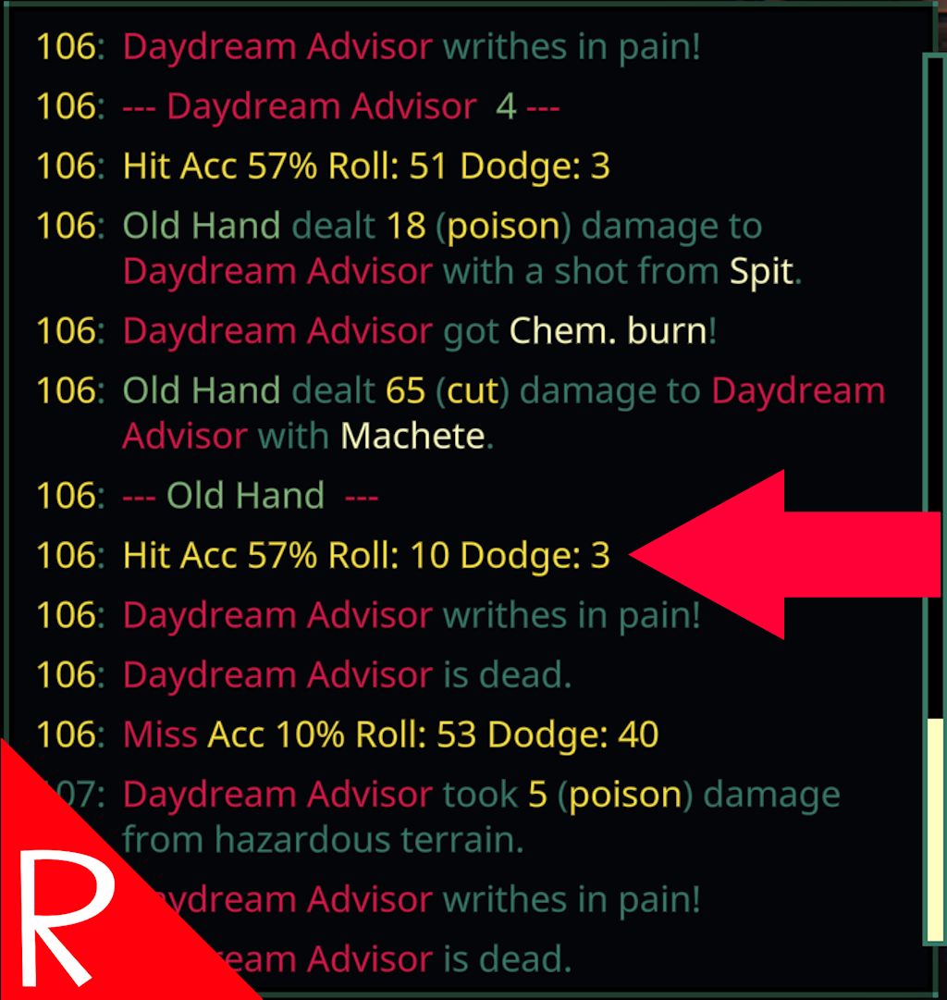

# Quasimorph More Combat Info

Adds the hit percentages to the combat log.
Note: The developers have hinted at the combat log having more information in the future, so this may be a short lived mod.

# Important
This version of the mod is only for the opt in beta version of the game!

# Docs
Example:  `Hit Acc 57% Roll: 51 Dodge: 3`

|Item|Description|
|--|--|
|Hit/Miss|If the attack was a hit or miss.|
|Acc|Accuracy.  This is the final accurracy adjusted by all bonsues and malauses.  Indicates the value to roll less than.|
|Roll|The random roll for the to hit.  Must be *under* the accuracy number.|
|Dodge|The target's dodge value.|

# Log Changes
The start of an attack will have a '--- \<attacker name\> ---' header line.  
Turn number on left of the log uses alternate colors per turn for better visibility.

# Notes
The hit rolls only show if the projectile crossed a creature.  So if a shot goes wide or hits a barrier, it will not show up in the combat log.

The accuracy and roll numbers are displayed as whole numbers, but are actually decimals.  It is possible for the display to show the same number but still miss.  Ex:  51 vs 51 when in reality it is 51.1 vs 51.3

# Known Issues
The game's log (Player.log) will have localization errors / warnings.  This does not impact the game.

# Support
If you enjoy my mods and want to buy me a coffee, check out my [Ko-Fi](https://ko-fi.com/nbkredspy71915) page.
Thanks!

# Source Code
Source code is available on GitHub at https://github.com/NBKRedSpy/QM_MoreCombatInfo

# Change Log

## 1.1.1
* Fixed attacker header not showing or ordered late in some cases.
* Added brackets around hit and miss.
* Added more dashes to attacker to find easier.
* Fixed null reference error due to Mono not liking null forgiving operators in some cases.
